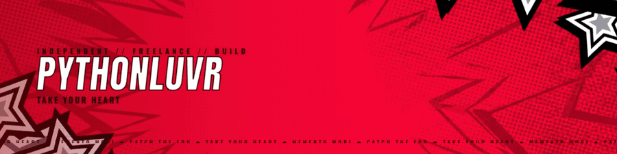
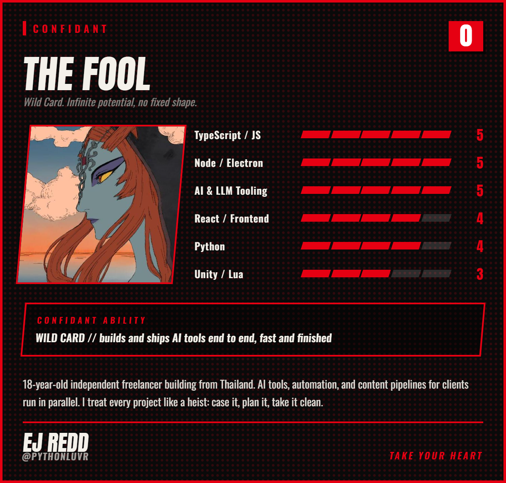

<!-- PythonLuvr // Persona-themed profile. Visual assets live in /assets. -->

<!-- ===================== BANNER ===================== -->

  

<!-- ===================== STAT PILLS ===================== -->

  
  
  

 

<!-- ===================== WHO AM I ===================== -->
<h2 align="center">⊳ WHO AM I?</h2>

  

 

<!-- ===================== CONTACT ===================== -->
<h2 align="center">⊳ CONTACT THE THIEF</h2>

  
  
  

 

<!-- ===================== ARSENAL ===================== -->
<h2 align="center">⊳ ARSENAL</h2>

  

 

<!-- ===================== THE TAKE (projects) ===================== -->
<h2 align="center">⊳ THE TAKE</h2>

Every tool here got cased, planned, and taken clean. All open source.

<table>
<tr>
<td valign="top" width="32%">

**★ [Weave](https://github.com/pythonluvr/weave-lang)** 

</td>
<td valign="top">A small, verifiable language for orchestrating AI agents. Write the workflow and the rules once; the rules become contracts the model must satisfy, checked every run and auto-corrected when it breaks one. Runs on Claude or Gemini, no API key.</td>
</tr>
<tr>
<td valign="top">

**[Slash](https://github.com/pythonluvr/slash)** 

</td>
<td valign="top">An AI-native, local-first web browser. The assistant searches, reads pages, and acts on the web for you, on your own machine. No account, no telemetry, trackers blocked, keys sealed in the OS keystore. The privacy claims are checkable, not promises.</td>
</tr>
<tr>
<td valign="top">

**[War Room](https://github.com/pythonluvr/war-room)** 

</td>
<td valign="top">Local-first Discord-style cockpit for solo operators running many clients and many AI agents at once. Plug in any OpenAI-Chat-Completions-compatible runtime.</td>
</tr>
<tr>
<td valign="top">

**[OpenWar](https://github.com/pythonluvr/openwar)** 

</td>
<td valign="top">Discipline layer for CLI agents. Runs Claude Code, Codex, and Gemini CLI under one phase-gated runtime with deterministic detectors, replayable traces, and persistent memory.</td>
</tr>
<tr>
<td valign="top">

**[Squire](https://github.com/pythonluvr/squire)** 

</td>
<td valign="top">General-purpose runtime for spawning CLI AI agents as subprocesses with structured event streaming, MCP tool forwarding, and Claude Code permission auto-setup.</td>
</tr>
<tr>
<td valign="top">

**[api-discover](https://github.com/pythonluvr/api-discover)** 

</td>
<td valign="top">Point at any website, get a typed API client plus an upfront verdict on whether HTTP-only replay will work (Turnstile, CSRF, WebSocket-delivered results, and the rest).</td>
</tr>
</table>

More tooling across agent ops, video, and motion lives in <a href="https://github.com/pythonluvr?tab=repositories">my repos</a>. When something earns its keep daily, it eventually ships here.

 

<!-- ===================== STATS ===================== -->

  
  

  

<!-- ===================== CONTRIBUTION GRAPH ===================== -->
<h2 align="center">⊳ THE INFILTRATION LOG</h2>

  

<!-- ===================== TROPHIES ===================== -->

  

 

<!-- ===================== FOOTER ===================== -->

  <h3>YOU'LL NEVER SEE IT COMING.</h3>
  Code is never finished. It only gets better.

